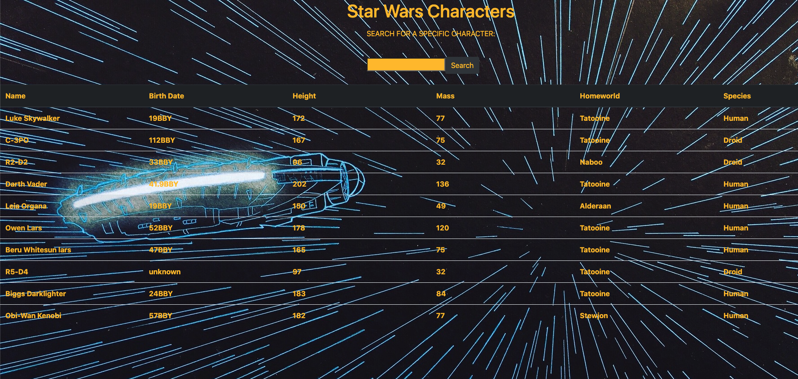

# My SWAPI App

An interactive page that lets you search for info about your favorite Star Wars characters

## Try it for yourself
Click link [here](https://swapi-with-react.herokuapp.com/)

## Preview

## Summary
This is my second application built using the React framework and my first time implementing an API call to populate the data. The learning curve during this project was a steep one. It pushed me, but I completed this and furthered my understanding, knowledge, and confidence in various aspects like multiple and simultaneous API calls, parsing received data properly, and furthering my knowledge of the React framework. While challenging, I feel like this project helped me grow as a developer by a huge margin.  

## Author
David Malchow - [LinkedIn](https://www.linkedin.com/in/david-malchow-809b106b/)
